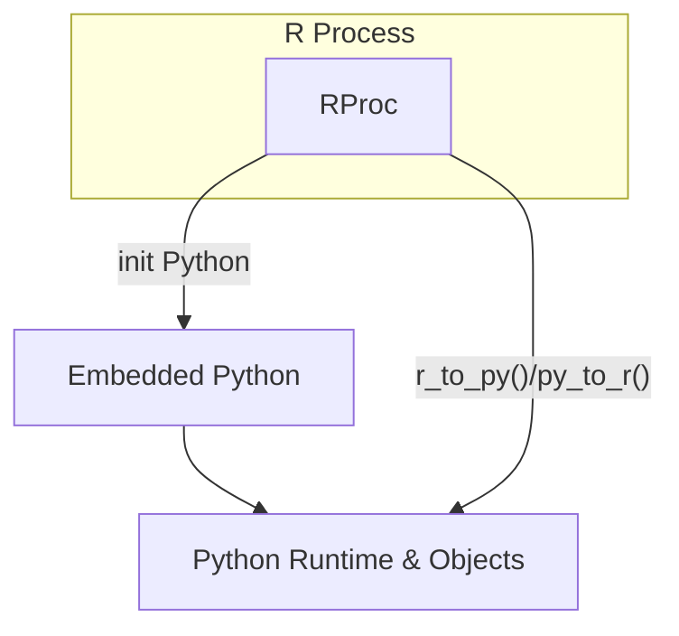

## Table of Contents

1. [Introduction to Reticulate](#1-introduction-to-reticulate)
2. [Importing a Python module](#2-importing-a-python-module)
3. [Attribute access and object lookup](#3-attribute-access-and-object-lookup)
4. [Calling Python functions and constructors](#4-calling-python-functions-and-constructors)
5. [Printing and representation of Python objects](#5-printing-and-representation-of-python-objects)
6. [OverSimplified Reticulate Arhitecture Schema](#6-oversimplified-reticulate-arhitecture-schema)
7. [Implications for data sharing](#7-implications-for-data-sharing)
8. [Resources](#8-resources)

---

### 1. Introduction to Reticulate

Reticulate is an R package that embeds a Python interpreter directly inside the R process and exposes Python objects to R through a lightweight proxy mechanism. Rather than relying on inter-process communication, Reticulate uses the **Python C API** to execute Python code in the same address space as R.

This design allows R code to call Python functions, access Python modules, and manipulate Python objects transparently, without launching a separate Python process.

This is a simple code example, creating a Pandas DataFrame inside R:

```r
library(reticulate)
pd <- import("pandas")
df <- pd$DataFrame(list(a = c(1, 2), b = c(3, 4)))
```

_Note_: The purpose of this article is not to provide a Reticulate tutorial, but to dive into Reticulate's architecture.

---

### 2. Importing a Python module

On the first interaction with Python, Reticulate initializes a Python interpreter embedded inside the R process using the Python C API.

```r
pd <- import("pandas")
```

Internally, Reticulate performs the following operations:

- Initializes the Python runtime (_Py_Initialize_)

- Imports the requested Python module

- At the C level, the import operation corresponds conceptually to:

```c
PyObject *pandas = PyImport_ImportModule("pandas");
```

On the R side, _pd_ is an R environment with an S3 class (for example, "python.builtin.module"). This environment contains an externalptr pointing to the underlying PyObject\*. All interactions with _pd_ are routed through this pointer and dispatched to Python via the C API.

The _import()_ function accepts a convert argument:

- convert = TRUE (default): Python objects are passed through _py_to_r()_ and converted to native R objects when possible.

- convert = FALSE: Python objects remain in Python and are represented in R only as proxy objects.

---

### 3. Attribute access and object lookup

Accessing attributes on a Python object from R uses the $ operator:

```r
dataframe_class <- pd$DataFrame
```

Each attribute access is translated into a Python getattr operation:

```c
PyObject_GetAttrString(pandas, "DataFrame");
```

The returned PyObject\* is wrapped in an R proxy object. Reference counting, error handling, and GIL management are handled internally by Reticulate.

---

### 4. Calling Python functions and constructors

When a Python function is called or a Python class is instantiated from R:

```r
df <- pd$DataFrame(list(a = c(1, 2), b = c(3, 4)))
```

Reticulate performs the following steps:

- Argument conversion via _r_to_py()_

- Execution inside the embedded Python interpreter

- Return value handling according to the convert flag

With convert = TRUE, Reticulate attempts to convert the result using _py_to_r()_:

- NumPy arrays may be converted efficiently (sometimes near zero-copy) because of the continous structure of a NumPy array

- Pandas DataFrames are fully converted and copied into R data.frame objects

With convert = FALSE, the Python object is returned as a proxy.

---

### 5. Printing and representation of Python objects

When a Python proxy object is printed in R, Reticulate delegates the operation to Python’s string representation:

```r
datetime <- import("datetime", convert = FALSE)
datetime$datetime$today()
```

The output is produced by Python’s **str** or **repr** methods via the Python C API. No R object is created; the data remains entirely in Python.

---

### 6. OverSimplified Reticulate Arhitecture Schema



---

### 7. Implications for data sharing

From a runtime perspective, Reticulate has several important implications:

- The Python interpreter runs inside the R process; a crash in either runtime terminates the process.

- Data is not truly shared between R and Python; it is transferred through explicit conversion.

- Near zero-copy transfer is possible for some NumPy arrays backed by contiguous memory.

- Higher-level objects, such as Pandas DataFrames, require full conversion and copying.

---

### 8. Resources

- [Reticulate repository](https://github.com/rstudio/reticulate)
- [Reticulate Tutorial](https://rstudio.github.io/reticulate/articles/calling_python.html)
- [Python C API Tutorial](https://www.youtube.com/watch?v=XGF3Qu4dUqk)

```

```
